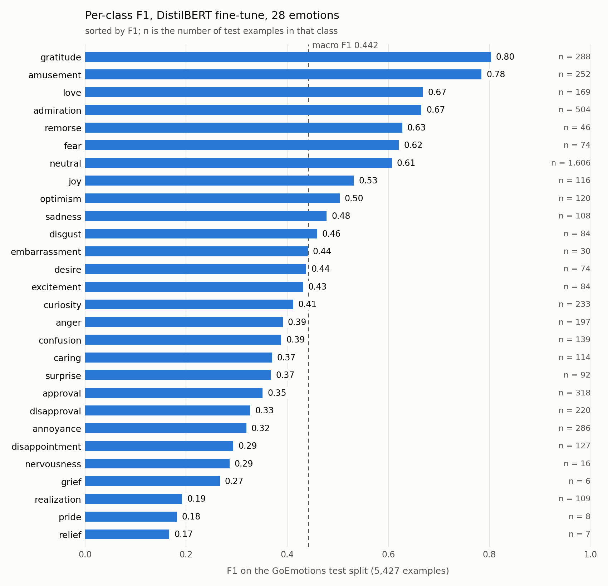

# GoEmotions DistilBERT

[](https://github.com/EssamWali/goemotions-distilbert/actions/workflows/ci.yml)

`distilbert-base-uncased` fine-tuned to label a sentence with one of 28
emotions, trained on
[GoEmotions](https://huggingface.co/datasets/google-research-datasets/go_emotions),
58k Reddit comments annotated by humans. The repository holds the training,
evaluation and prediction scripts, the measured test-split metrics, and the
notebook with the original exploration. The checkpoint itself is not included;
`train.py` reproduces it.

```
$ python predict.py "thanks so much, you saved me hours"
  -> gratitude 1.00, amusement 0.00, annoyance 0.00

$ python predict.py "I'm not sure I understand the question"
  -> confusion 0.90, neutral 0.09, annoyance 0.00
```



## Results

Measured on the held-out test split, 5,427 examples not seen in training.

| | model | majority-class baseline |
| --- | --- | --- |
| accuracy | **0.535** | 0.296 |
| macro F1 | **0.442** | 0.016 |
| weighted F1 | 0.528 | — |

Nearly a third of the dataset is `neutral`, so a model that answers `neutral`
to everything scores 0.296 accuracy. Macro F1 weights all 28 classes equally
and is the number reported first for that reason: 0.442 against a baseline of
0.016 shows the fine-tune learned the rare emotions, not only the common one.

Per-class F1 spans a wide range:

| strongest | | weakest | |
| --- | --- | --- | --- |
| gratitude | 0.803 | relief | 0.167 |
| amusement | 0.784 | pride | 0.182 |
| love | 0.668 | realization | 0.192 |
| admiration | 0.665 | grief | 0.267 |
| fear | 0.621 | nervousness | 0.286 |

The strong classes have a reliable surface form ("thank you" is gratitude,
"lol" is amusement). The weak ones are rare classes with no characteristic
wording: `grief` has six examples in the test split, `relief` seven, `pride`
eight, and `realization` is a distinction human annotators also find hard.

Full per-class precision, recall and support: [`metrics.json`](metrics.json).
The chart above is drawn from it by [`scripts/plot_metrics.py`](scripts/plot_metrics.py).

## How it works

A standard fine-tune of `distilbert-base-uncased` with a 28-way classification
head: six epochs, AdamW at 5e-5, batch size 16, sequences truncated at 128
tokens and padded dynamically to the longest sequence in each batch. Two
choices shape every number above.

**Multi-label collapsed to single-label.** GoEmotions annotates each comment
with any number of emotions. `train.py` and `evaluate.py` both keep only the
first annotation (falling back to `neutral` when there is none) and treat the
task as 28-way single-label classification. This is a simplification and puts
a ceiling on the scores: an example genuinely carrying two emotions can only be
counted right for one of them. A multi-label version would use a sigmoid head
with per-class thresholds. `tests/test_labels.py` checks that training and
evaluation apply the same rule.

**Class-weighted loss.** The cross-entropy weights are inverse class frequency
over the training split, normalised to sum to one. Without them the model
converges on answering `neutral`, which scores 0.296 accuracy and near-zero
macro F1. The weighting is what makes the rare classes score at all.

`evaluate.py` runs the checkpoint over the test split with the same label rule,
reports accuracy, macro F1 and weighted F1 alongside the majority-class
baseline, and writes the full `classification_report` to `metrics.json`.
`predict.py` prints the top-3 softmax probabilities for a sentence, or for each
line on stdin.

## Running it

```
pip install -r requirements.txt

python train.py --epochs 6     # writes checkpoint.pt
python evaluate.py             # metrics on the test split, writes metrics.json
python predict.py "some text"  # or pipe lines on stdin
pytest tests -q                # label-rule agreement (pip install pytest first)
```

The checkpoint is not in the repository (256 MB of weights, plus 512 MB of
optimiser state, both over GitHub's 100 MB limit). `train.py` reproduces it in
roughly fifteen minutes on a mid-range GPU; the dataset downloads automatically
through `datasets`.

## Known limitations

- Single-label treatment of a multi-label dataset, as above.
- Trained and evaluated on Reddit comments; performance drops on text that does
  not resemble them.
- `neutral` absorbs many borderline inputs. "why does nothing in this codebase
  make sense" is classified `neutral 0.87` where `annoyance` fits better.
- No calibration. The probabilities are softmax outputs and should not be read
  as confidence.

## Layout

| path | what it is |
| --- | --- |
| `train.py` | fine-tune on the GoEmotions train split, save `checkpoint.pt` |
| `evaluate.py` | score the checkpoint on the test split, write `metrics.json` |
| `predict.py` | classify a sentence or stdin lines with the checkpoint |
| `metrics.json` | test-split metrics: aggregate, baseline, per-class report |
| `scripts/plot_metrics.py` | draw `docs/img/per-class-f1.png` from `metrics.json` |
| `tests/test_labels.py` | train and eval derive the single label the same way |
| `notebooks/exploration.ipynb` | the original exploration; does not run top to bottom |

More: [development notes](docs/notes.md) on the notebook this came from and
what was fixed, why the checkpoint is not committed, and what CI checks.
